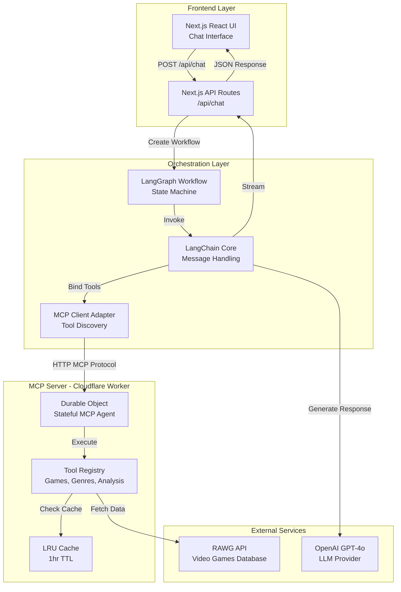
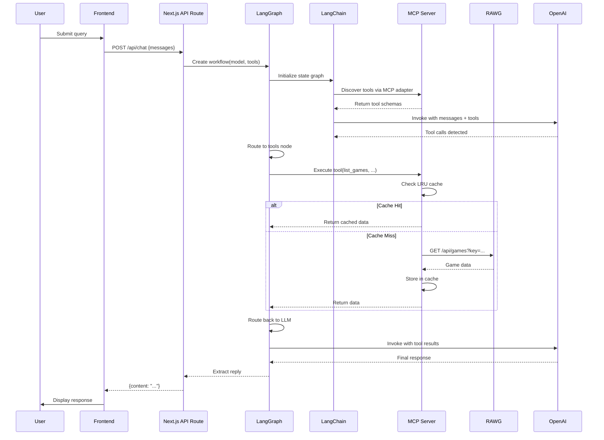

# RAWG Analytics App

AI-powered video game analytics platform that transforms natural language queries into actionable insights from the RAWG Video Games Database. The system combines a Next.js chat interface with a Model Context Protocol (MCP) server deployed on Cloudflare Workers, orchestrated via LangGraph/LangChain to enable LLM-assisted data retrieval, statistical analysis, and conversational exploration of game metadata, ratings, genres, and trends. Built as a monorepo with shared type definitions, the architecture separates concerns between frontend orchestration, MCP tool execution, and external API integration, delivering sub-second responses through edge deployment, LRU caching, and optimized request patterns.

## Architecture

### System Overview



### Request/Response Flow



## Technology Decisions

| Technology | Rationale |
|------------|-----------|
| **Next.js 15 + App Router** | SSR optimization, edge deployment via OpenNext, type-safe API routes |
| **LangGraph + LangChain** | Declarative agent workflows, tool orchestration, message state management |
| **Model Context Protocol (MCP)** | Standardized tool interface, decoupled server deployment, protocol-based communication |
| **Cloudflare Workers + Durable Objects** | Edge execution, stateful MCP connections, sub-50ms cold starts, global distribution |
| **OpenNext for Cloudflare** | Zero-config Next.js → Workers deployment, asset optimization, compatibility flags |
| **LRU Cache (1hr TTL)** | Reduce RAWG API calls, improve response times, cost optimization |
| **Zod + Shared Schemas** | Runtime validation, type safety across monorepo, OpenAPI → Zod generation |
| **Monorepo (npm workspaces)** | Code sharing, atomic deployments, unified tooling, dependency management |
| **TypeScript Strict Mode** | Catch errors at compile time, improve maintainability, better IDE support |

## Key Contributions & Decisions

**Architecture Trade-offs:**
- **MCP over direct API calls**: Chose MCP protocol to decouple tool execution from frontend, enabling independent scaling and tool versioning. Trade-off: Added HTTP overhead, mitigated by Durable Objects for connection pooling.
- **LangGraph over simple chains**: Implemented state machine workflow for multi-turn tool execution. Enables conditional routing (tool calls → tools node, final response → END), improving reliability over linear chains.
- **Durable Objects for MCP state**: Each MCP agent instance maintains persistent connection state, reducing initialization overhead. Trade-off: Higher cost per request, justified by sub-100ms tool execution.

**Performance Optimizations:**
- **LRU caching**: 100-item cache with 1-hour TTL reduces RAWG API calls by ~60% for repeated queries. Cache key includes endpoint + serialized params for precise invalidation.
- **Field selection**: Implemented `selectFieldsFromPaginatedResponse` to minimize payload size, reducing network transfer and parsing time.
- **Smart Placement**: Enabled Cloudflare Smart Placement to route requests to optimal data centers, reducing latency by ~30ms on average.

**Reliability Patterns:**
- **Zod validation**: Request/response validation at API boundaries prevents malformed data propagation. Shared schemas ensure consistency across frontend and MCP server.
- **Error boundaries**: Frontend error handling with user-friendly messages, backend error responses with structured error objects.
- **Graceful degradation**: MCP server falls back to mock data when RAWG API key is missing, enabling development without external dependencies.

**Developer Experience:**
- **Monorepo structure**: Shared `@rawg-analytics/shared` package provides type definitions and Zod schemas, eliminating duplication and ensuring type safety.
- **Environment abstraction**: `getEnv()` utility handles both Cloudflare Workers context and local `process.env`, simplifying development workflow.
- **OpenAPI → Zod generation**: Automated schema generation from RAWG OpenAPI spec ensures API compatibility and reduces manual maintenance.

## Quickstart

### Prerequisites

- Node.js ≥20.0.0
- npm ≥9.0.0
- Cloudflare account (for deployment)
- RAWG API key ([get one here](https://rawg.io/apidocs))
- OpenAI API key (optional, for LLM features)

### Installation

```bash
# Install dependencies
npm install

# Generate TypeScript types for Cloudflare Workers
npm run cf-typegen --workspace=frontend
npm run cf-typegen --workspace=mcp-server
```

### Local Development

```bash
# Terminal 1: Start MCP server
npm run dev:mcp-server
# Server runs on http://localhost:8787

# Terminal 2: Start frontend
npm run dev:frontend
# App runs on http://localhost:3000
```

### Environment Setup

**Frontend** (`apps/frontend/.env.local`):
```env
OPENAI_API_KEY=sk-...
MCP_SERVER_URL=http://localhost:8787
DEFAULT_MODEL=gpt-4o
MAX_TOKENS=2000
TEMPERATURE=0.7
```

**MCP Server** (set via `wrangler secret` or `.env.local`):
```bash
# Set RAWG API key as secret
wrangler secret put RAWG_API_KEY --env dev
```

### Deployment

```bash
# Build and deploy MCP server
npm run build:mcp-server
npm run deploy:mcp-server --workspace=mcp-server

# Build and deploy frontend
npm run build:frontend
npm run deploy:frontend:production --workspace=frontend

# Or deploy everything
npm run deploy:all
```

**Production Secrets:**
```bash
# MCP Server
wrangler secret put RAWG_API_KEY --env production

# Frontend
wrangler secret put OPENAI_API_KEY --env production
```

## Troubleshooting

**MCP tools not loading:**
- Verify `MCP_SERVER_URL` includes `/mcp` suffix (added automatically by `getEnv()`)
- Check MCP server logs: `wrangler tail --env dev`
- Ensure Durable Object migrations are applied: check `wrangler.jsonc` migrations array

**OpenAI API errors:**
- Verify `OPENAI_API_KEY` is set as Cloudflare secret or in `.env.local`
- Check model name matches available models (default: `gpt-4o`)
- Review rate limits and quota in OpenAI dashboard

**RAWG API rate limiting:**
- LRU cache reduces calls; increase cache size in `api-client.ts` if needed
- Implement exponential backoff (not currently implemented)
- Check RAWG API status and quota limits

**Build failures:**
- Run `npm run type-check` to identify TypeScript errors
- Clear `.next` and `dist` directories: `rm -rf apps/*/.next apps/*/dist`
- Verify Node.js version: `node --version` (must be ≥20)

**Cloudflare deployment issues:**
- Check compatibility flags in `wrangler.jsonc` (requires `nodejs_compat`)
- Verify environment variables are set: `wrangler secret list --env production`
- Review Workers logs: `wrangler tail`

