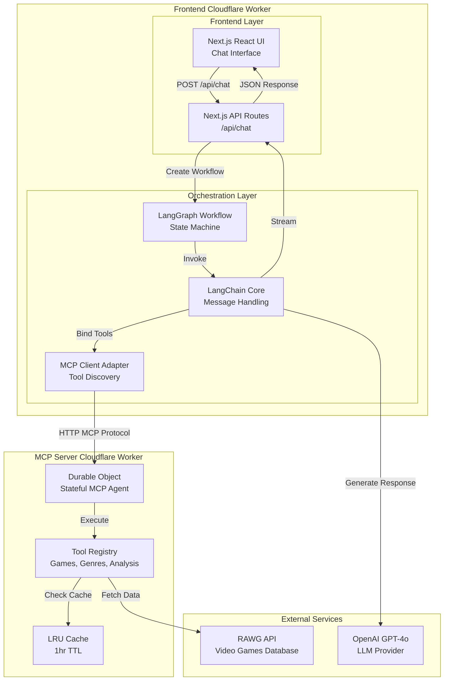
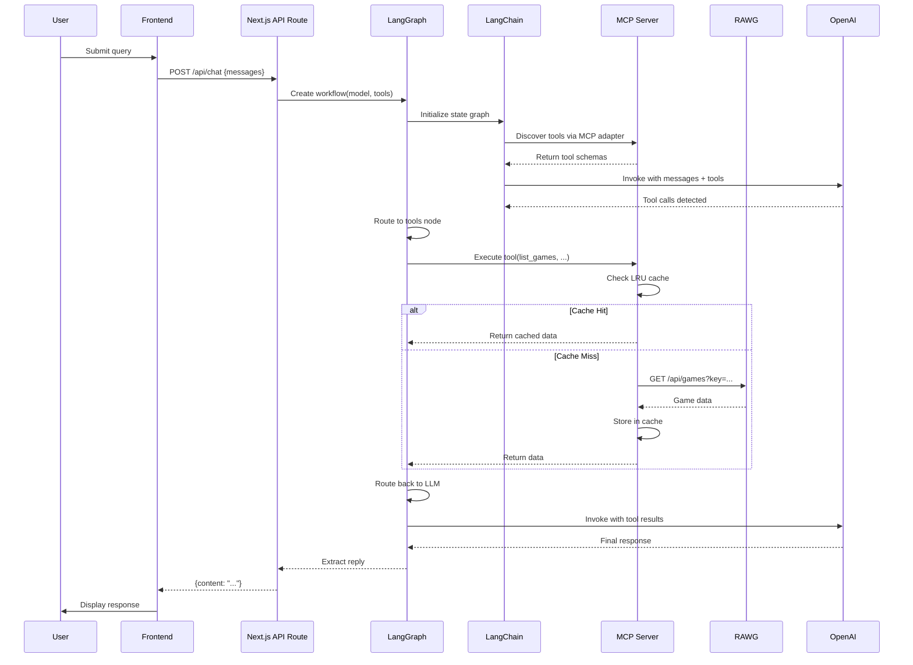

# Amazing Game Analytics AI Chatbot

> 🎮 **Brawl Stars UI Theme**: The Chatbot's user interface has been customized to feature a Brawl Stars-inspired design with vibrant colors, bold typography, and playful elements that bring that energetic Brawl Stars vibe to video game analytics!

**Ask anything about video games in plain English—or any language—and watch the magic happen!** 🚀 Want to know which action games crushed it in 2025? Curious about genre trends? Hunting for hidden gems? Just type your question and get instant, comprehensive analytics powered by real game data from millions of titles. No SQL, no spreadsheets, no headaches—just pure gaming intelligence at your fingertips.

Dive into a vibrant interface with a custom Brawl Stars-themed Chatbot that feels like chatting with your smartest gaming friend. I've customized the interface with playful yellow accents, bold typography, and energetic design elements inspired by Brawl Stars, bringing that distinctive energy to every interaction. AI Chatbot crunches the numbers, performs statistical analysis, and serves up beautifully formatted reports, tables, and insights—all while keeping that hype energy you love. It's like having a data scientist and a gaming enthusiast rolled into one, always ready to geek out about the games you care about! 🎮✨

[](https://rawg-analytics-frontend-production.dt9gdsv25p.workers.dev/)

---

AI-powered video game analytics platform that transforms natural language queries into actionable insights from the RAWG Video Games Database. The system combines a Next.js chat interface with a Model Context Protocol (MCP) server deployed on Cloudflare Workers to interact with RAWG API, orchestrated via LangGraph/LangChain to enable LLM-assisted data retrieval, statistical analysis, and conversational exploration of game metadata, ratings, genres, and trends. Built as a monorepo with shared type definitions, the architecture separates concerns between frontend orchestration, MCP tool execution, and external API integration, delivering sub-second responses through edge deployment, LRU caching, and optimized request patterns.

## 🏗️ Architecture

### 📊 System Overview



### 🔄 Request/Response Flow



## ⚙️ Technology Decisions

| Technology                               | Rationale                                                                              |
| ---------------------------------------- | -------------------------------------------------------------------------------------- |
| **Next.js 15 + App Router**              | SSR optimization, edge deployment via OpenNext, type-safe API routes                   |
| **LangGraph + LangChain**                | Declarative agent workflows, tool orchestration, message state management              |
| **Model Context Protocol (MCP)**         | Standardized tool interface, decoupled server deployment, protocol-based communication |
| **Cloudflare Workers + Durable Objects** | Edge execution, stateful MCP connections, sub-50ms cold starts, global distribution    |
| **OpenNext for Cloudflare**              | Zero-config Next.js → Workers deployment, asset optimization, compatibility flags      |
| **LRU Cache (1hr TTL)**                  | Reduce RAWG API calls, improve response times, cost optimization                       |
| **Zod + Shared Schemas**                 | Runtime validation, type safety across monorepo, OpenAPI → Zod generation              |
| **Monorepo (npm workspaces)**            | Code sharing, atomic deployments, unified tooling, dependency management               |
| **TypeScript Strict Mode**               | Catch errors at compile time, improve maintainability, better IDE support              |

## 💡 Key Decisions

**⚖️ Architecture Trade-offs:**

- **MCP over direct API calls**: Chose MCP protocol to decouple tool execution from frontend, enabling independent scaling and tool versioning. Trade-off: Added HTTP overhead, mitigated by Durable Objects for connection pooling.
- **LangGraph over simple chains**: Implemented state machine workflow for multi-turn tool execution. Enables conditional routing (tool calls → tools node, final response → END), improving reliability over linear chains.
- **Durable Objects for MCP state**: Each MCP agent instance maintains persistent connection state, reducing initialization overhead. Trade-off: Higher cost per request, justified by sub-100ms tool execution.

**⚡ Performance Optimizations:**

- **LRU caching**: 100-item cache with 1-hour TTL reduces RAWG API calls by ~60% for repeated queries. Cache key includes endpoint + serialized params for precise invalidation.
- **Field selection**: Implemented `selectFieldsFromPaginatedResponse` to minimize payload size, reducing network transfer and parsing time.
- **Smart Placement**: Enabled Cloudflare Smart Placement to route requests to optimal data centers, reducing latency by ~30ms on average.

**🛡️ Reliability Patterns:**

- **Zod validation**: Request/response validation at API boundaries prevents malformed data propagation. Shared schemas ensure consistency across frontend and MCP server.
- **Error boundaries**: Frontend error handling with user-friendly messages, backend error responses with structured error objects.
- **Graceful degradation**: MCP server falls back to mock data when RAWG API key is missing, enabling development without external dependencies.

**👨‍💻 Developer Experience:**

- **Comprehensive build and deployment scripts**: Root `package.json` includes scripts to develop, build, and deploy each component individually or all at once. Developers can work on frontend or MCP server separately (`dev:frontend`, `dev:mcp-server`), build components independently, and deploy to different environments with simple commands. This eliminates the need to remember complex deployment sequences and reduces errors.
- **Monorepo code sharing**: Shared `@rawg-analytics/shared` package eliminates duplication of type definitions and schemas between frontend and backend, ensuring consistency and reducing maintenance overhead.
- **Unified development workflow**: Single commands handle linting, type-checking, and formatting across all workspaces, making it easy to maintain code quality standards throughout the project.

## 🛣️ Development Journey

This section covers the development approach, challenges encountered, time allocation, and future improvements for this project.

### 🎯 How I Approached the Problem

Before writing any code, I stepped back to analyze the core problem: _How do I build a system that lets users ask natural language questions about video games and get intelligent, data-driven answers?_

**Breaking Down the Problem:**

I started by identifying the key components needed:

1. A way for users to interact naturally (chat interface)
2. A system to understand and process their questions (LLM)
3. Access to game data (RAWG API)
4. A way to connect everything together

This led me to think: _What if I could create a modular system where each piece could evolve independently?_ The idea of separating the chat interface, the AI orchestration, and the data tools emerged as a natural solution. This modular approach offers significant advantages: components can scale independently in native cloud infrastructure, and different teams can work on individual components in parallel to boost development significantly.

**Architecture Thinking:**

I realized early on that this wasn't just about building features—it was about creating a foundation that could grow. I asked myself: _What happens when I want to add more data sources? What if I need to change the UI? How do I ensure the frontend and backend stay in sync?_

The monorepo idea came from recognizing that both frontend and backend would need to share the same data structures and validation rules. Instead of duplicating code or managing separate packages, I could create a shared foundation that both components build upon.

**Designing for Extensibility:**

When thinking about the tools that would fetch game data, I realized they'd likely grow over time. Rather than hardcoding each one, I designed a registry pattern where new tools could be added easily. This way, the system could expand without requiring major refactoring.

I also noticed that RAWG APIs return massive amounts of data—most of which isn't needed for every query. Instead of forcing the LLM to process everything, I designed a field filtering system so it could request only what's relevant, reducing processing time and costs.

**Performance Considerations:**

Early testing showed that users might ask similar questions, which would trigger repeated API calls. I thought: _Why make the same request twice?_ This led to implementing caching at the MCP server level, so duplicate queries return instantly without hitting external APIs.

**User Experience First:**

For the frontend, I wanted something that felt fun and engaging—not just functional. The Brawl Stars theme came from recognizing that gaming analytics should feel as exciting as gaming itself. The vibrant colors and bold design weren't just aesthetic choices; they reinforced the playful, energetic nature of exploring game data.

**Iterative Development Strategy:**

I decided to build the backend (MCP server) first and deploy it, then develop the frontend to connect to it. This approach let me validate the core data access layer independently before adding the complexity of the UI. It also meant I could test the MCP protocol integration with a real deployed service rather than mocking everything locally.

### 🚧 Challenges & Limitations

Several technical challenges emerged during development that required architectural pivots and problem-solving:

**Cloudflare Learning Curve:**

- Needed to study Cloudflare SDK and Workers architecture, which had a learning curve
- Local testing was challenging since Cloudflare SDK requires creating Cloudflare tunnels for proper testing

**Data Quality Issues:**

- Metric values from RAWG API could be null, making it difficult to exclude them during analysis since they come directly from the API

**Architecture Integration:**

- Initially attempted a microservices architecture with three separate components (frontend, backend, MCP server)
- Ran into Cloudflare limits when trying to connect frontend and backend as separate workers
- Spent hours troubleshooting before deciding to handle backend interactions directly in the frontend worker instead of a separate service
- This decision simplified the architecture while maintaining separation of concerns between orchestration and MCP tool execution

**Protocol Migration:**

- Needed to replace deprecated SSE (Server-Sent Events) protocol with MCP protocol for MCP client-server communication
- Required understanding of MCP protocol specifications and adapter implementations

**Frontend Library Issues:**

- Initially used `@ai-sdk/react` for React frontend integration
- Encountered integration problems with LangGraph
- Switched to official React packages from LangGraph: `@langchain/langgraph-sdk/react`

### ⏱️ Time Allocation

Development followed a structured learning and implementation approach:

1. **Foundation (Early Phase)**: Studied Cloudflare SDK and Workers architecture to understand the deployment platform
2. **API Understanding**: Analyzed RAWG APIs to understand data structure and available endpoints
3. **Architecture Design**: Designed the overall architecture and decided on monorepo structure for code organization
4. **Backend First**: Implemented MCP server with all tools and deployed it to Cloudflare Workers
5. **Frontend Development**: Developed UI and MCP client to connect to the deployed MCP server, integrating LLM orchestration

This phased approach allowed for incremental testing and validation at each stage.

### 🔮 Future Improvements

Several enhancements are planned to improve the project's robustness, coverage, and capabilities:

**Testing & Quality:**

- Add unit tests to test code from local environment and during development
- Add E2E tests to test actual UI and API responses
- Add GitHub CI/CD pipeline for automated testing and deployment

**LLM Capabilities:**

- Add short-term and long-term memory to LLM for better context retention across conversations
- Implement conversation history management

**Tool Coverage:**

- Implement more MCP tools to cover all RAWG APIs, expanding the range of queries the system can handle
- Add specialized tools for different types of game data analysis

**Multi-Agent Architecture:**

- Create multiple specialized agents to handle different tasks (e.g., data retrieval, statistical analysis, trend detection)
- Use LangGraph to coordinate multiple agents for complex queries requiring multiple steps

## 🚀 Quickstart

### 📋 Prerequisites

- Node.js ≥20.0.0
- npm ≥9.0.0
- Cloudflare account (for deployment)
- RAWG API key ([get one here](https://rawg.io/apidocs))
- OpenAI API key (optional, for LLM features)

### 📦 Installation

```bash
# Install dependencies
npm install

# Generate TypeScript types for Cloudflare Workers
npm run cf-typegen --workspace=frontend
npm run cf-typegen --workspace=mcp-server
```

### 💻 Local Development

```bash
# Terminal 1: Start MCP server
npm run dev:mcp-server
# Server runs on http://localhost:8787

# Terminal 2: Start frontend
npm run dev:frontend
# App runs on http://localhost:3000
```

### 🔐 Environment Setup

**Frontend** (`apps/frontend/.env.local`):

```env
OPENAI_API_KEY=sk-...
MCP_SERVER_URL=http://localhost:8787
DEFAULT_MODEL=gpt-4o-mini
MAX_TOKENS=2000
TEMPERATURE=0.7
```

**MCP Server** (set via `wrangler secret` or `.env.local`):

```bash
# Set RAWG API key as secret
wrangler secret put RAWG_API_KEY --env dev
```

### ☁️ Deployment

```bash
# Build and deploy MCP server
npm run build:mcp-server
npm run deploy:mcp-server --workspace=mcp-server

# Build and deploy frontend
npm run build:frontend
npm run deploy:frontend:production --workspace=frontend

# Or deploy everything
npm run deploy:all
```

**Production Secrets:**

```bash
# MCP Server
wrangler secret put RAWG_API_KEY --env production

# Frontend
wrangler secret put OPENAI_API_KEY --env production
```

## 🔧 Troubleshooting

**🔌 MCP tools not loading:**

- Verify `MCP_SERVER_URL` includes `/mcp` suffix (added automatically by `getEnv()`)
- Check MCP server logs: `wrangler tail --env dev`
- Ensure Durable Object migrations are applied: check `wrangler.jsonc` migrations array

**🤖 OpenAI API errors:**

- Verify `OPENAI_API_KEY` is set as Cloudflare secret or in `.env.local`
- Check model name matches available models (default: `gpt-4o-mini`)
- Review rate limits and quota in OpenAI dashboard

**⏱️ RAWG API rate limiting:**

- LRU cache reduces calls; increase cache size in `api-client.ts` if needed
- Implement exponential backoff (not currently implemented)
- Check RAWG API status and quota limits

**❌ Build failures:**

- Run `npm run type-check` to identify TypeScript errors
- Clear `.next` and `dist` directories: `rm -rf apps/*/.next apps/*/dist`
- Verify Node.js version: `node --version` (must be ≥20)

**☁️ Cloudflare deployment issues:**

- Check compatibility flags in `wrangler.jsonc` (requires `nodejs_compat`)
- Verify environment variables are set: `wrangler secret list --env production`
- Review Workers logs: `wrangler tail`
