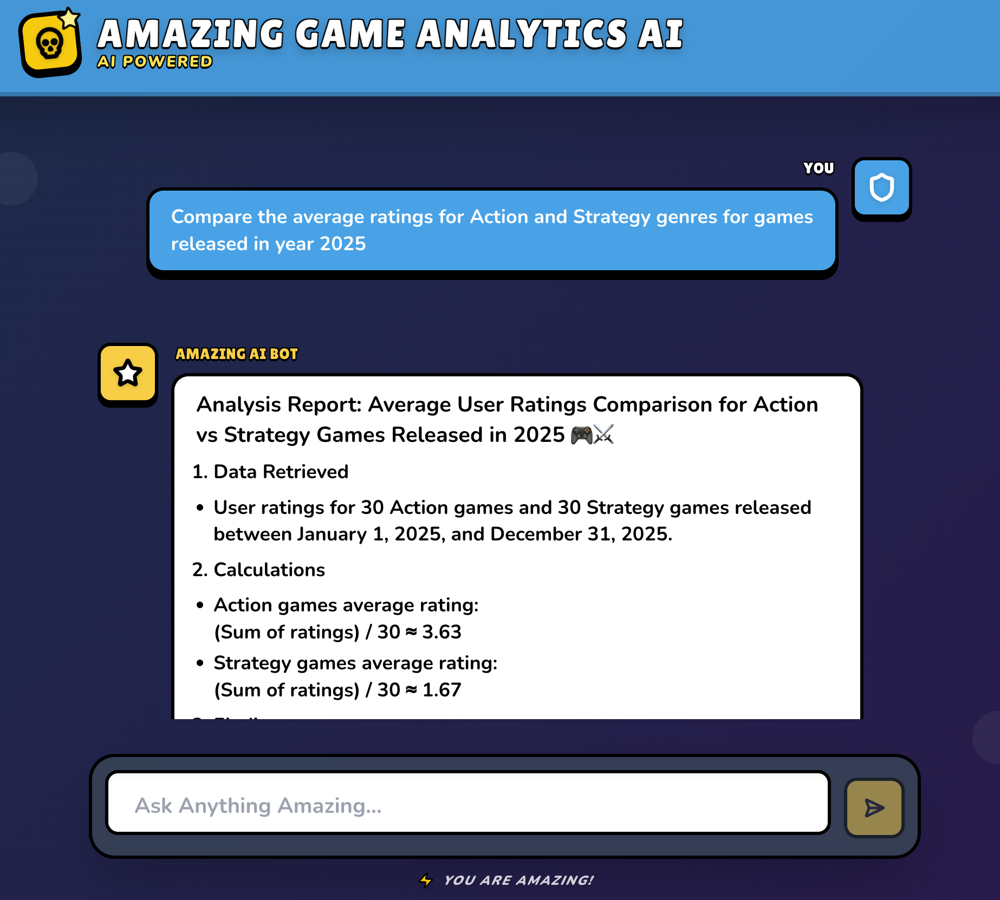
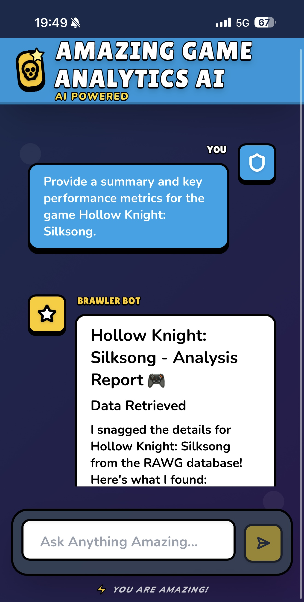
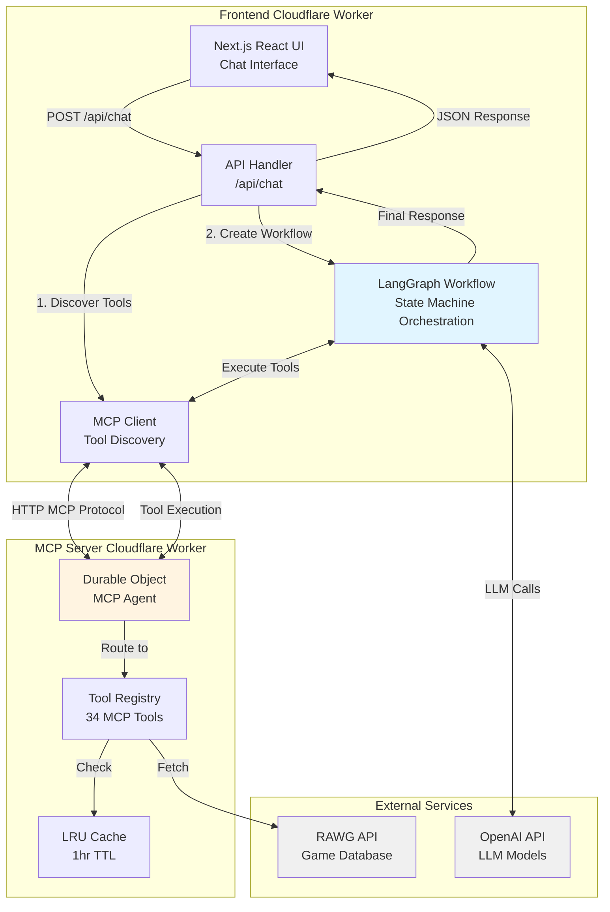
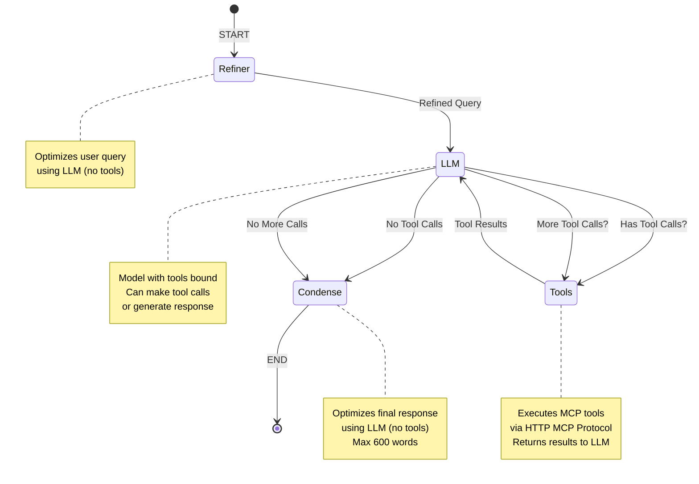
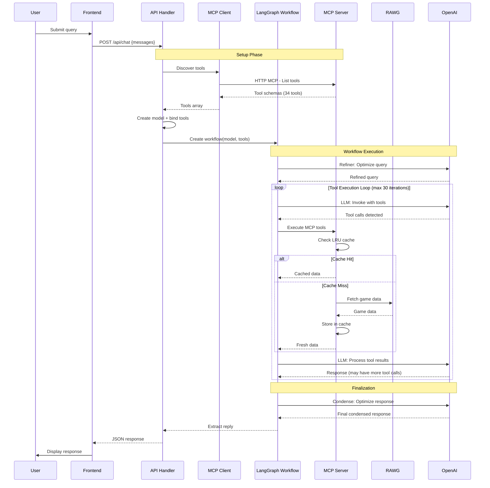

# Amazing Game Analytics AI Chatbot

## 📑 Table of Contents

- [Overview](#-overview)
- [Preview](#-preview)
- [Architecture](#-architecture)
- [Technology Stack](#-technology-stack)
- [Features & Use Cases](#-features--use-cases)
- [Development Journey](#-development-journey)
- [Quickstart](#-quickstart)
- [Troubleshooting](#-troubleshooting)

---

## 📋 Overview

**Ask anything about video games in plain English and get instant analytics!** 🚀 Just type your question and watch the AI crunch numbers from millions of game titles. No SQL, no spreadsheets, just pure gaming intelligence. Dive into a vibrant Brawl Stars-themed chatbot that serves up beautifully formatted reports and insights with that energetic vibe you love! 🎮✨

Built as a monorepo with modular architecture: the frontend (Next.js React) handles chat and LLM orchestration via LangGraph, while a separate MCP server manages **34 MCP tools** covering all RAWG APIs with intelligent caching. The system delivers sub-second responses through edge deployment on Cloudflare, LRU caching, and optimized request patterns.

> **🏭 Production-Ready Architecture**: Enterprise-grade architecture with edge computing, intelligent caching, modular design, and comprehensive error handling for high availability and sub-second response times.

[](https://rawg-analytics-frontend-production.dt9gdsv25p.workers.dev/)

---

## 📸 Preview

<div align="center">
  <table align="center">
    <tr>
      <td align="center"><strong>Web View</strong></td>
      <td align="center"><strong>Mobile View</strong></td>
    </tr>
    <tr>
      <td align="center"></td>
      <td align="center"></td>
    </tr>
  </table>
</div>

---

## 💼 Features & Use Cases

**Real-World Scenarios:**

- **Market Analysis**: Developers analyze genre trends and platform preferences with statistical insights across thousands of games
- **Competitive Intelligence**: Publishers compare competitor portfolios by genre, platform, and release timing for strategic planning
- **Game Discovery**: Gamers find the best games by criteria (genre, year, ratings) with instant filtered results

**Key Value Propositions:** ⚡ Speed (seconds not hours) • 📊 Accuracy (direct RAWG integration) • 🧠 Intelligence (AI-powered insights) • 🌐 Accessibility (natural language, no SQL) • 📈 Scalable (simple to complex queries)

---

## 🏗️ Architecture

The system uses a three-part architecture: **Frontend Worker** (Next.js React UI + LangGraph orchestration), **MCP Server Worker** (34 tools with LRU caching), and **External Services** (OpenAI LLM, RAWG API). The LangGraph workflow orchestrates multi-turn tool execution with conditional routing, enabling complex queries through iterative data retrieval and analysis.

### 📊 System Overview



### 🔄 LangGraph Workflow Detail



### 🔄 Request/Response Flow



---

## ⚙️ Technology Stack

| Technology                               | Rationale                                                                                  |
| ---------------------------------------- | ------------------------------------------------------------------------------------------ |
| **Next.js 15 + App Router**              | SSR optimization, type-safe API routes                                                     |
| **LangGraph**                            | Declarative agent workflows with state machine orchestration for multi-turn tool execution |
| **Model Context Protocol (MCP)**         | Standardized tool interface, decoupled server deployment, independent scaling              |
| **Cloudflare Workers + Durable Objects** | Edge execution, stateful MCP connections, sub-50ms cold starts, global distribution        |
| **LRU Cache (1hr TTL)**                  | Reduces RAWG API calls by ~60%, improves response times                                    |
| **Zod + Shared Schemas**                 | Runtime validation, type safety across monorepo, OpenAPI → Zod generation                  |
| **Monorepo (npm workspaces)**            | Code sharing, atomic deployments, unified tooling                                          |
| **TypeScript Strict Mode**               | Catch errors at compile time, improve maintainability                                      |

### Key Architecture Decisions

**Three-part architecture**: Frontend (Next.js React UI), orchestration (LangGraph workflow), and MCP server (34 tools) enable independent scaling and parallel development.

**MCP over direct API calls**: Protocol-based decoupling enables independent tool versioning and scaling.

**LangGraph state machine**: Conditional routing (tool calls → tools node, final response → condense) improves reliability over linear chains.

**Performance optimizations**: LRU caching (~60% API call reduction), field selection (minimize payloads), Cloudflare Smart Placement (optimal routing).

**Statistical analysis tools**: Four specialized tools (Execute Calculation, Compare Groups, Trend Analysis, Correlation Analysis) with automatic result interpretation and built-in ranking.

---

## 🛣️ Development Journey

### 🎯 How I Approached the Problem

Before writing any code, I stepped back to analyze the core problem: _How do I build a system that lets users ask natural language questions about video games and get intelligent, data-driven answers?_

I started by identifying the key components needed: a chat interface, an LLM system to process questions, access to game data via RAWG API, and a way to connect everything together.

This led me to think: _What if I could create a modular system where each piece could evolve independently?_ The idea of separating the chat interface, the AI orchestration, and the data tools emerged as a natural solution. This modular approach enables components to scale independently and allows different teams to work on individual components in parallel.

**Architecture Thinking:**

I realized early on that this wasn't just about building features. It was about creating a foundation that could grow. I asked myself: _What happens when I want to add more data sources? What if I need to change the UI? How do I ensure the frontend and backend stay in sync?_

The monorepo idea came from recognizing that both frontend and backend would need to share the same data structures and validation rules. Instead of duplicating code or managing separate packages, I created a shared foundation that both components build upon.

**Designing for Extensibility:**

When thinking about the tools that would fetch game data, I realized they'd likely grow over time. Rather than hardcoding each one, I designed a registry pattern where new tools could be added easily. This way, the system could expand without requiring major refactoring.

I also noticed that RAWG APIs return massive amounts of data, most of which isn't needed for every query. Instead of forcing the LLM to process everything, I designed a field filtering system so it could request only what's relevant, reducing processing time and costs. **Result**: Lower LLM token usage and faster response generation.

**Performance Considerations:**

Early testing showed that users might ask similar questions, which would trigger repeated API calls. I thought: _Why make the same request twice?_ This led to implementing caching at the MCP server level, so duplicate queries return instantly without hitting external APIs. **Result**: Reduction in API costs and sub-second response times for cached queries.

**User Experience First:**

For the frontend, I wanted something that felt fun and engaging, not just functional. The Brawl Stars theme came from recognizing that gaming analytics should feel as exciting as gaming itself. The vibrant colors and bold design weren't just aesthetic choices; they reinforced the playful, energetic nature of exploring game data.

**Iterative Development Strategy:**

I decided to build the backend (MCP server) first and deploy it, then develop the frontend to connect to it. This approach let me validate the core data access layer independently before adding the complexity of the UI. It also meant I could test the MCP protocol integration with a real deployed service rather than mocking everything locally.

---

### 🚧 Challenges & Solutions

**Architecture Integration Pivot:**

- Initially attempted microservices with three separate workers (frontend, backend, MCP server)
- Hit Cloudflare limits connecting separate workers
- **Solution**: Consolidated backend orchestration into frontend worker while maintaining separation of concerns

**Protocol Migration:**

- Replaced deprecated SSE with MCP protocol for client-server communication
- Required deep understanding of MCP specifications and adapter implementations

**Frontend Library Issues:**

- `@ai-sdk/react` had integration problems with LangGraph
- **Solution**: Switched to official `@langchain/langgraph-sdk/react` packages

**Cloudflare Learning Curve:**

- Studied Workers architecture and Durable Objects
- Local testing required Cloudflare tunnels for proper validation

**Data Quality:**

- RAWG API returns null values that need handling during statistical analysis

---

### ⏱️ Time Allocation

**Foundation & Learning (Early Phase)**

- Studied Cloudflare Workers architecture and Durable Objects
- Analyzed RAWG APIs to understand data structures and endpoints

**Architecture & Design**

- Designed three-part architecture (Frontend, Orchestration, MCP Server)
- Decided on monorepo structure for code organization and shared schemas

**Backend Implementation**

- Built MCP server with 34 tools covering all RAWG APIs
- Implemented tool registry pattern and LRU caching
- Deployed to Cloudflare Workers for validation

**Frontend Development**

- Developed Next.js React UI with Brawl Stars theme
- Integrated MCP client and LangGraph workflow orchestration
- Connected to deployed MCP server for end-to-end testing

This phased approach enabled incremental validation and real-world protocol testing at each stage.

---

### 🔮 Future Improvements

**Testing & Quality**: Unit tests, E2E tests, GitHub CI/CD pipeline

**LLM Capabilities**: Short-term and long-term memory, conversation history management

**Tool Coverage**: Expand query range, add specialized analysis tools

**Multi-Agent Architecture**: Specialized agents for data retrieval, statistical analysis, and trend detection, coordinated via LangGraph

---

## 🚀 Quickstart

### 📋 Prerequisites

- Node.js ≥20.0.0
- npm ≥9.0.0
- Cloudflare account (for deployment)
- RAWG API key ([get one here](https://rawg.io/apidocs))
- OpenAI API key (optional, for LLM features)

### 📦 Installation

```bash
# Install dependencies
npm install

# Generate TypeScript types for Cloudflare Workers
npm run cf-typegen --workspace=frontend
npm run cf-typegen --workspace=mcp-server
```

### 💻 Local Development

```bash
# Terminal 1: Start MCP server
npm run dev:mcp-server
# Server runs on http://localhost:8787

# Terminal 2: Start frontend
npm run dev:frontend
# App runs on http://localhost:3000
```

### 🔐 Environment Setup

**Frontend** (`apps/frontend/.env.local`):

```env
OPENAI_API_KEY=sk-...
MCP_SERVER_URL=http://localhost:8787
DEFAULT_MODEL=gpt-4.1-mini
MAX_TOKENS=16000
TEMPERATURE=1
```

**MCP Server** (set via `wrangler secret` or `.env.local`):

```bash
# Set RAWG API key as secret
wrangler secret put RAWG_API_KEY --env dev
```

### ☁️ Deployment

```bash
# Build and deploy MCP server
npm run build:mcp-server
npm run deploy:mcp-server --workspace=mcp-server

# Build and deploy frontend
npm run build:frontend
npm run deploy:frontend:production --workspace=frontend

# Or deploy everything
npm run deploy:all
```

**Production Secrets:**

```bash
# MCP Server
wrangler secret put RAWG_API_KEY --env production

# Frontend
wrangler secret put OPENAI_API_KEY --env production
```

---

## 🔧 Troubleshooting

**🔌 MCP tools not loading:**

- Verify `MCP_SERVER_URL` includes `/mcp` suffix (added automatically by `getEnv()`)
- Check MCP server logs: `wrangler tail --env dev`
- Ensure Durable Object migrations are applied: check `wrangler.jsonc` migrations array

**🤖 OpenAI API errors:**

- Verify `OPENAI_API_KEY` is set as Cloudflare secret or in `.env.local`
- Check model name matches available models (default: `gpt-4.1-mini`)
- Review rate limits and quota in OpenAI dashboard

**⏱️ RAWG API rate limiting:**

- LRU cache reduces calls; increase cache size in `api-client.ts` if needed
- Implement exponential backoff (not currently implemented)
- Check RAWG API status and quota limits

**❌ Build failures:**

- Run `npm run type-check` to identify TypeScript errors
- Clear `.next` and `dist` directories: `rm -rf apps/*/.next apps/*/dist`
- Verify Node.js version: `node --version` (must be ≥20)

**☁️ Cloudflare deployment issues:**

- Check compatibility flags in `wrangler.jsonc` (requires `nodejs_compat`)
- Verify environment variables are set: `wrangler secret list --env production`
- Review Workers logs: `wrangler tail`
