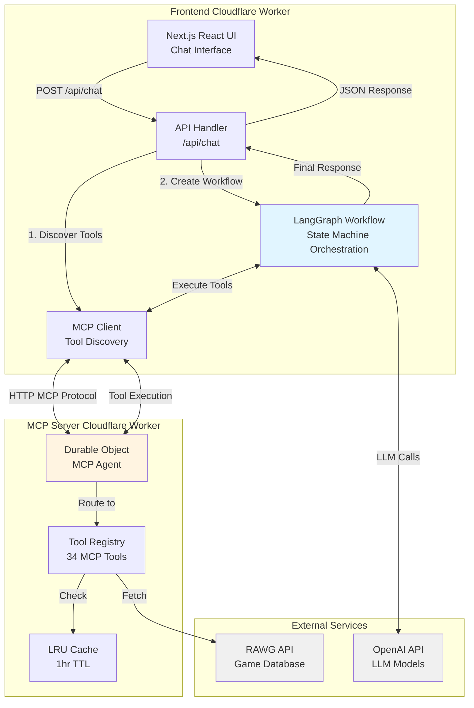
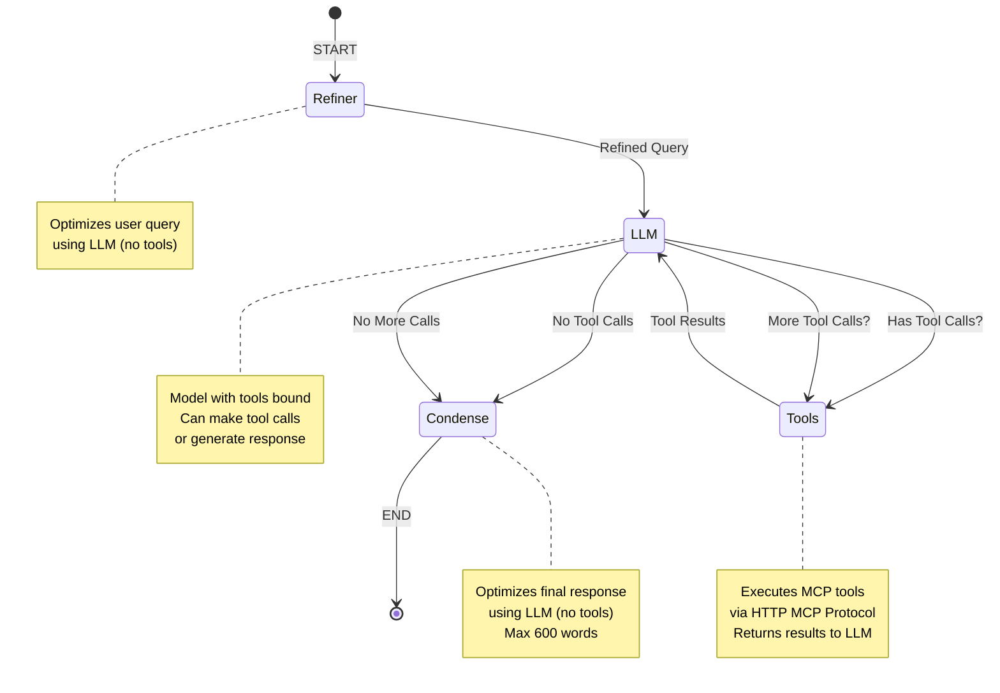
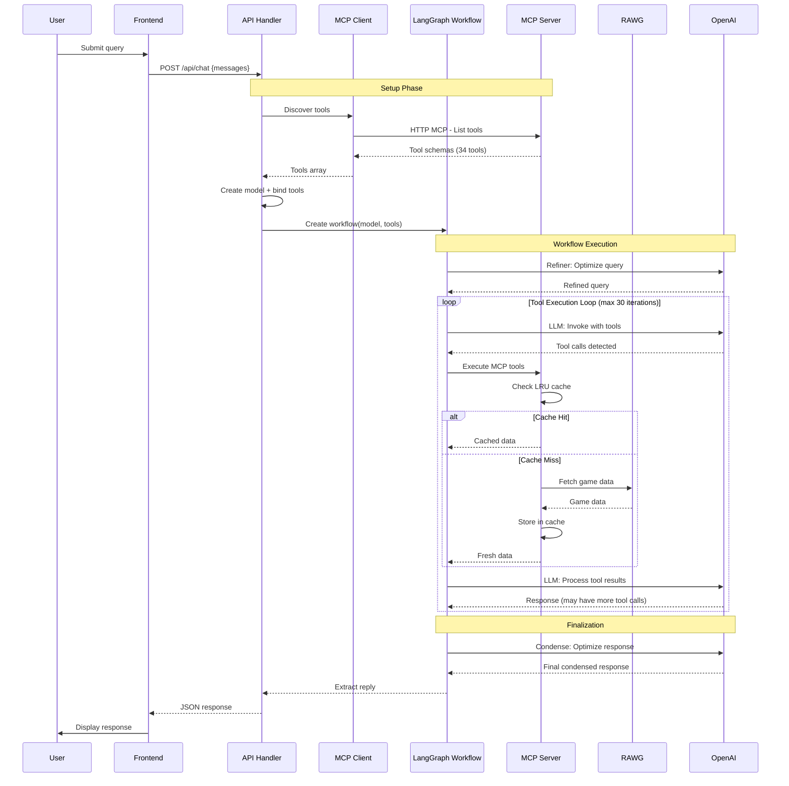

# Amazing Game Analytics AI Chatbot

## 📑 Table of Contents

- [Overview](#-overview)
- [Preview](#-preview)
- [Features & Use Cases](#-features--use-cases)
- [Architecture](#-architecture)
- [Technology Stack](#-technology-stack)
- [Development Journey](#-development-journey)
- [Quickstart](#-quickstart)
- [Troubleshooting](#-troubleshooting)

---

## 📋 Overview

**Ask anything about video games in plain English and get instant analytics!** 🚀 Just type your question and watch the AI crunch numbers from millions of game titles. No SQL, no spreadsheets, just pure gaming intelligence. Dive into a vibrant Brawl Stars-themed chatbot that serves up beautifully formatted reports and insights with that energetic vibe you love! 🎮✨

Built as a monorepo with modular architecture: the frontend (Next.js React) handles chat and LLM orchestration via LangGraph, while a separate MCP server manages **34 MCP tools** covering all RAWG APIs with intelligent caching. The system delivers sub-second responses through edge deployment on Cloudflare, LRU caching, and optimized request patterns.

> **🏭 Production-Ready Architecture**: Enterprise-grade architecture with edge computing, intelligent caching, modular design, and comprehensive error handling for high availability and sub-second response times.

[](https://rawg-analytics-frontend-production.dt9gdsv25p.workers.dev/)

---

## 📸 Preview

<div align="center">
  <table align="center">
    <tr>
      <td align="center"><strong>Web View</strong></td>
      <td align="center"><strong>Mobile View</strong></td>
    </tr>
    <tr>
      <td align="center"></td>
      <td align="center"></td>
    </tr>
  </table>
</div>

---

## 💼 Features & Use Cases

**Real-World Scenarios:**

- **Market Analysis**: Developers analyze genre trends and platform preferences with statistical insights across thousands of games
- **Competitive Intelligence**: Publishers compare competitor portfolios by genre, platform, and release timing for strategic planning
- **Game Discovery**: Gamers find the best games by criteria (genre, year, ratings) with instant filtered results

**Key Value Propositions:** ⚡ Speed (seconds not hours) • 📊 Accuracy (direct RAWG integration) • 🧠 Intelligence (AI-powered insights) • 🌐 Accessibility (natural language, no SQL) • 📈 Scalable (simple to complex queries)

---

## 🏗️ Architecture

The system uses a three-part architecture: **Frontend Worker** (Next.js React UI + LangGraph orchestration), **MCP Server Worker** (34 tools with LRU caching), and **External Services** (OpenAI LLM, RAWG API). The LangGraph workflow orchestrates multi-turn tool execution with conditional routing, enabling complex queries through iterative data retrieval and analysis.

### 📊 System Overview



### 🔄 LangGraph Workflow Detail



### 🔄 Request/Response Flow



---

## ⚙️ Technology Stack

| Technology                               | Rationale                                                                                  |
| ---------------------------------------- | ------------------------------------------------------------------------------------------ |
| **Next.js 15 + App Router**              | SSR optimization, type-safe API routes                                                     |
| **LangGraph**                            | Declarative agent workflows with state machine orchestration for multi-turn tool execution |
| **Model Context Protocol (MCP)**         | Standardized tool interface, decoupled server deployment, independent scaling              |
| **Cloudflare Workers + Durable Objects** | Edge execution, stateful MCP connections, sub-50ms cold starts, global distribution        |
| **LRU Cache (1hr TTL)**                  | Reduces redundant RAWG API calls, improves response times                                  |
| **Zod + Shared Schemas**                 | Runtime validation, type safety across monorepo, OpenAPI → Zod generation                  |
| **Monorepo (npm workspaces)**            | Code sharing, atomic deployments, unified tooling                                          |
| **TypeScript Strict Mode**               | Catch errors at compile time, improve maintainability                                      |

### Key Architecture Decisions

**Three-part architecture**: Frontend (Next.js React UI), orchestration (LangGraph workflow), and MCP server (34 tools) enable independent scaling and parallel development.

**MCP over direct API calls**: Protocol-based decoupling enables independent tool versioning and scaling.

**LangGraph state machine**: Conditional routing (tool calls → tools node, final response → condense) improves reliability over linear chains.

**Performance optimizations**: LRU caching (reduces redundant API calls), field selection (minimize payloads), Cloudflare Smart Placement (optimal routing).

**Statistical analysis tools**: Four specialized tools (Execute Calculation, Compare Groups, Trend Analysis, Correlation Analysis) with automatic result interpretation and built-in ranking.

---

## 🛣️ Development Journey

### 🏗️ Architecture & Design Decisions

**Three-Part Modular Architecture**

Separated the system into three independent components: Frontend Worker (Next.js React UI + LangGraph orchestration), MCP Server Worker (34 tools with caching), and External Services (OpenAI LLM, RAWG API).

**Trade-off**: Considered monolithic approach for simplicity, but chose modularity to enable independent scaling and parallel development. Each component scales based on its workload (user traffic, tool usage, LLM requests).

**LangGraph State Machine over Simple Chains**

Implemented state machine workflow using LangGraph instead of linear chains.

**Trade-off**: Linear chains are simpler but don't handle multi-turn tool execution well. LangGraph's conditional routing (tool calls → tools node, final response → condense) improves reliability and enables iterative data gathering.

**Additional decisions**: Monorepo with shared schemas for type safety across the stack, tool registry pattern for easy extensibility (34 tools can be added without core changes).

---

### 🚧 Technical Challenges & Solutions

**Architecture Integration Pivot**

**Problem**: Initially attempted microservices with three separate Cloudflare Workers. Hit platform limits connecting separate workers.

**Options**: Keep separate workers (unreliable), consolidate everything (loses separation), or move orchestration into frontend worker (maintains separation, works within limits).

**Solution**: Consolidated backend orchestration into frontend worker while maintaining separation through code organization. MCP server remains separate for independent scaling.

**Result**: Architecture works within Cloudflare's constraints while preserving modularity.

**Frontend Library Integration**

**Problem**: `@ai-sdk/react` had compatibility issues with LangGraph workflows.

**Options**: Fix compatibility (time-consuming), build custom integration (reinventing), or switch to official LangGraph packages (refactoring required, but official support).

**Solution**: Switched to official `@langchain/langgraph-sdk/react` packages designed for LangGraph integration.

**Result**: Stable integration with official support and better TypeScript types.

---

### ⚡ Performance Optimizations

**LRU Caching**: Implemented at MCP server level with 1-hour TTL. Cache key includes endpoint path and serialized parameters for precise hits. Reduces redundant API calls and improves response times for repeated queries.

**Field Filtering**: RAWG APIs return extensive data, but most fields aren't needed per query. Implemented field filtering so LLM requests only relevant fields, reducing token usage and processing costs.

**Cloudflare Smart Placement**: Enabled intelligent request routing to optimal data centers, improving global latency and reliability.

---

### ⏱️ Development Timeline

**Phase 1: Foundation & Learning** - Studied Cloudflare Workers/Durable Objects, analyzed RAWG APIs

**Phase 2: Architecture & Design** - Designed three-part architecture, decided on monorepo structure, designed tool registry pattern

**Phase 3: Backend Implementation** - Built MCP server with 34 tools, implemented registry pattern and LRU caching, deployed to Cloudflare Workers for validation

**Phase 4: Frontend Development** - Developed Next.js React UI, integrated MCP client and LangGraph workflow, connected to deployed MCP server for end-to-end testing

**Learning approach**: Started with documentation and proof-of-concepts. Built MCP server first and deployed it, then connected frontend. This real-world integration testing revealed platform-specific issues (like Workers connection limits) that wouldn't appear in local mocks.

---

### 🔮 Future Improvements

**Testing & Quality**: Unit tests, E2E tests, GitHub CI/CD pipeline

**LLM Capabilities**: Short-term and long-term memory, conversation history management

**Tool Coverage**: Expand query range, add specialized analysis tools

**Multi-Agent Architecture**: Specialized agents for data retrieval, statistical analysis, and trend detection, coordinated via LangGraph

---

## 🚀 Quickstart

### 📋 Prerequisites

- Node.js ≥20.0.0
- npm ≥9.0.0
- Cloudflare account (for deployment)
- RAWG API key ([get one here](https://rawg.io/apidocs))
- OpenAI API key (optional, for LLM features)

### 📦 Installation

```bash
# Install dependencies
npm install

# Generate TypeScript types for Cloudflare Workers
npm run cf-typegen --workspace=frontend
npm run cf-typegen --workspace=mcp-server
```

### 💻 Local Development

```bash
# Terminal 1: Start MCP server
npm run dev:mcp-server
# Server runs on http://localhost:8787

# Terminal 2: Start frontend
npm run dev:frontend
# App runs on http://localhost:3000
```

### 🔐 Environment Setup

**Frontend** (`apps/frontend/.env.local`):

```env
OPENAI_API_KEY=sk-...
MCP_SERVER_URL=http://localhost:8787
DEFAULT_MODEL=gpt-4.1-mini
MAX_TOKENS=16000
TEMPERATURE=1
```

**MCP Server** (set via `wrangler secret` or `.env.local`):

```bash
# Set RAWG API key as secret
wrangler secret put RAWG_API_KEY --env dev
```

### ☁️ Deployment

```bash
# Build and deploy MCP server
npm run build:mcp-server
npm run deploy:mcp-server --workspace=mcp-server

# Build and deploy frontend
npm run build:frontend
npm run deploy:frontend:production --workspace=frontend

# Or deploy everything
npm run deploy:all
```

**Production Secrets:**

```bash
# MCP Server
wrangler secret put RAWG_API_KEY --env production

# Frontend
wrangler secret put OPENAI_API_KEY --env production
```

---

## 🔧 Troubleshooting

**🔌 MCP tools not loading:**

- Verify `MCP_SERVER_URL` includes `/mcp` suffix (added automatically by `getEnv()`)
- Check MCP server logs: `wrangler tail --env dev`
- Ensure Durable Object migrations are applied: check `wrangler.jsonc` migrations array

**🤖 OpenAI API errors:**

- Verify `OPENAI_API_KEY` is set as Cloudflare secret or in `.env.local`
- Check model name matches available models (default: `gpt-4.1-mini`)
- Review rate limits and quota in OpenAI dashboard

**⏱️ RAWG API rate limiting:**

- LRU cache reduces calls; increase cache size in `api-client.ts` if needed
- Implement exponential backoff (not currently implemented)
- Check RAWG API status and quota limits

**❌ Build failures:**

- Run `npm run type-check` to identify TypeScript errors
- Clear `.next` and `dist` directories: `rm -rf apps/*/.next apps/*/dist`
- Verify Node.js version: `node --version` (must be ≥20)

**☁️ Cloudflare deployment issues:**

- Check compatibility flags in `wrangler.jsonc` (requires `nodejs_compat`)
- Verify environment variables are set: `wrangler secret list --env production`
- Review Workers logs: `wrangler tail`
